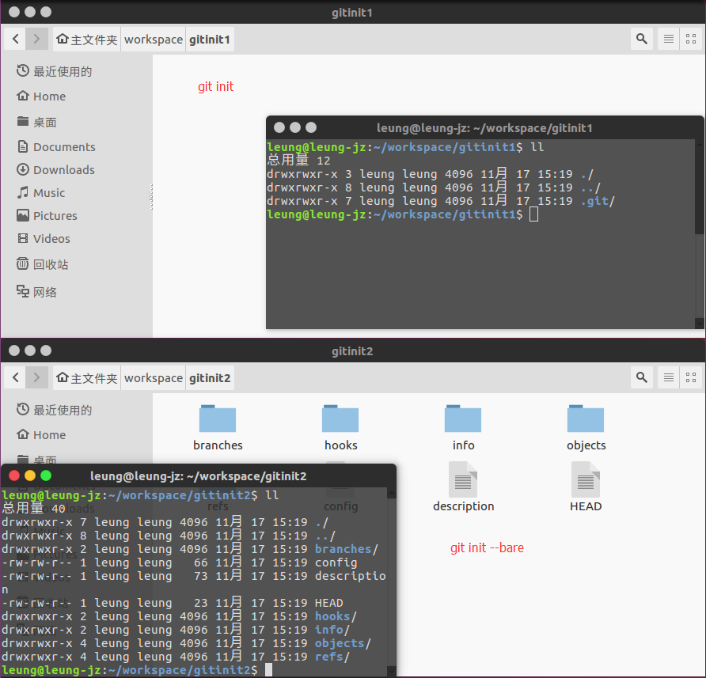
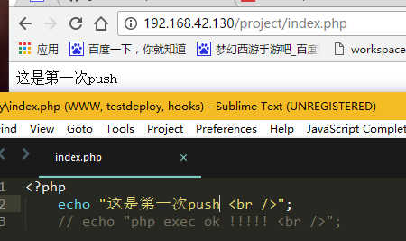
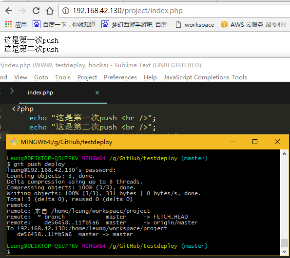

最近正在寻找一种简便的自动部署代码到服务器的方式，然后就发现了git hooks这个方法，查了一些资料再自己尝试过后，觉得还不错，记录下。
<!-- more -->
## 什么是git hooks
在git上是这么介绍的：
>和其它版本控制系统一样，Git能在特定的重要动作发生时触发自定义脚本。有两组这样的钩子：客户端的和服务器端的。客户端钩子由诸如提交和合并这样的操作所调用，而服务器端钩子作用于诸如接收被推送的提交这样的联网操作。 你可以随心所欲地运用这些钩子。

我觉得可以这么理解，一个钩子就像是js中的回调，每当git完成一个动作，如`commit`，`push`等，就可以触发相对应的事件。

## git hooks的种类
git中，有两种类型的钩子：客户端的和服务器端的。

客户端的钩子有：
1.  `pre-commit` 钩子在键入提交信息前运行。

2.  `prepare-commit-msg` 钩子在启动提交信息编辑器之前，默认信息被创建之后运行。

3.  `post-commit` 钩子在整个提交过程完成后运行。
4.  `applypatch-msg` 你可以用该脚本来确保提交信息符合格式，或直接用脚本修正格式错误。
5.  `pre-applypatch` 在 `git am` 运行期间被调用
6.  `post-applypatch` 运行于提交产生之后，是在 `git am` 运行期间最后被调用的钩子。
7.  `pre-rebase`  钩子运行于变基之前，以非零值退出可以中止变基的过程。
8.  `post-rewrite` 钩子被那些会替换提交记录的命令调用。
9.  `post-checkout` 在 `git checkout` 成功运行后调用。
10.  `post-merge` 在 `git merge` 成功运行后调用。
11.  `pre-push` 在 `git push` 运行期间， 更新了远程引用但尚未传送对象时被调用。
12.  `pre-auto-gc` 会在垃圾回收开始之前被调用，可以用它来提醒你现在要回收垃圾了，或者依情形判断是否要中断回收。

服务器端的钩子有：
1.  `pre-receive` 处理来自客户端的推送操作时最先被调用。
2.  `update` 它会为每一个准备更新的分支各运行一次。
3.  `post-receive` 在整个过程完结以后运行，可以用来更新其他系统服务或者通知用户。

##  如何使用git hooks
所有的钩子脚本都存放在 `.git/hooks` 文件夹中。当使用 `git init` 初始化一个新版本库时，Git 默认会在这个目录中放置一些示例脚本。这些示例的名字都是以 `.sample` 结尾，如果你想启用它们，得先移除这个后缀。

##  简单的自动部署
###    在服务器初始化一个远程git仓库

####   `git init` 和 `git init --bare` 的区别
初始化出来的仓库是不一样的，前者初始化的是一个普通的仓库，其中 `.git` 文件夹是隐藏的，并且能看见该仓库下所有的源码。而后者初始化出来的仓库中的文件，就是 `.git` 中的文件夹，但不能像前者那样直接浏览或修改仓库中的代码。


####   使用 `git init --bare` 初始化一个远程仓库。
该仓库是用于项目部署的。在我们本地开发完成后，将项目push至该仓库后，将自动部署网站。
```bash
$   cd ~/workspace
$   mkdir project
$   cd project
$   git init --bare
```

###     在服务器初始化一个本地仓库
因为php的项目基本不需要编译后运行，所以将网站的根目录作为本地仓库了。
```bash
$   cd /var/www/html/project
$   git clone ~/workspace/project
```
<del>之前看教程都是新建一个 `project` 文件夹再 `clone`，但是这样会将项目目录就变成了 `/var/www/html/project/project` 所以直接在根目录 `clone` 即可。</del>

###     为远程仓库设置一个 hook
设置一个 `post-receive` 钩子，当仓库收到push请求后，就会自动执行该钩子中的脚本。
现在就通过该钩子实现简单的项目部署。
```bash
#!/bin/sh
unset GIT_DIR
cd /var/www/html/project
git pull origin master
```
编辑完成后，给该脚本添加可执行权限
```bash
$   chmod +x post-receive
```

##  测试是否能自动部署
### 为开发的本地仓库添加remote源
这个客户端本地仓库，即开发的机子的本地仓库，添加remote源，以后往这个remote push代码时，就会自动触发上面的脚本。
```bash
$   git remote add deploy user@ip:/gitrepo_dir
$   git push deploy master
```
### 测试
在开发机上浏览项目：


### 修改后再测试
在 `index.php` 中添加一句 `echo "这是第二次push <br />";`。然后像平时一样，commit，push到代码仓库中（该仓库是origin而不是deploy，是平时托管代码的仓库，如github等），再push到deploy仓库中。
根据返回的信息，可以看出，远程服务器中已经部署成功了。
再次刷新浏览器，可以看到网页已经被修改了。


好了，一个简单的自动部署PHP项目的教程就到这了。其实，通过合理的设置 git hooks 可以实现很多功能，大家可以去慢慢挖掘。
