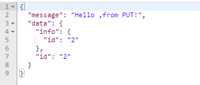
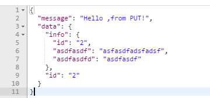
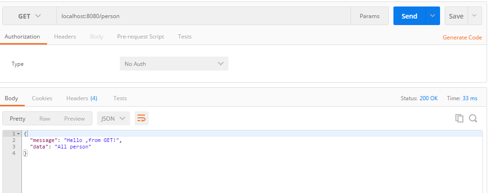
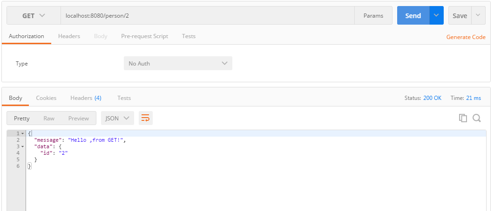
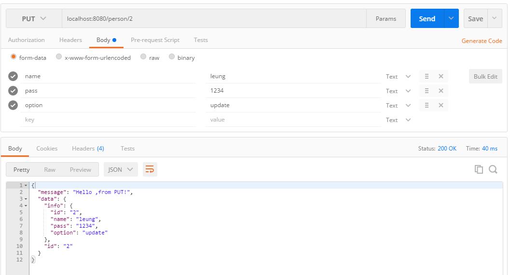
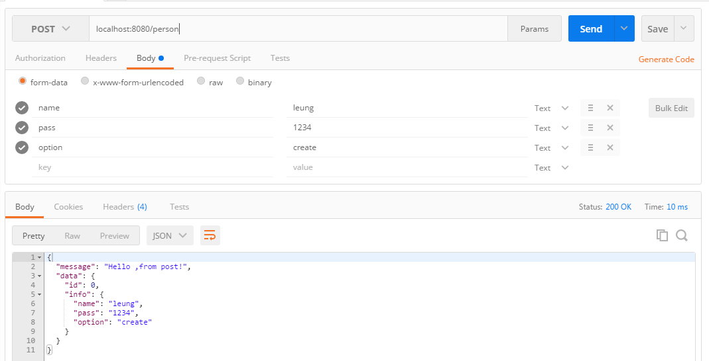

使用 restify 框架搭建一个简易的 REST Web 服务。
<!-- more -->
##  什么是 RESTful 架构？

>具象状态传输（英文：Representational State Transfer，简称REST）是Roy Thomas Fielding博士于2000年在他的博士论文 “Architectural Styles and the Design of Network-based Software Architectures” 中提出来的一种万维网软件架构风格。

>目前在三种主流的Web服务实现方案中，因为REST模式与复杂的SOAP和XML-RPC相比更加简洁，越来越多的web服务开始采用REST风格设计和实现。例如，Amazon.com提供接近REST风格的Web服务执行图书查询；雅虎提供的Web服务也是REST风格的。

具体可以阅读 阮一峰 的日志 RESTful API 设计指南 ，或是参考 维基百科

##  什么是 restify 框架？

>restify is a node.js module built specifically to enable you to build correct REST web services. It intentionally borrows heavily from express as that is more or less the de facto API for writing web applications on top of node.js.

>restify 是专门帮助你建立正确的 REST Web 服务的 Node.js 模块，它有意地大量借鉴了Express。

##  安装使用 restify
### 安装

`$ npm install restify`

### 编写基于 REST 的 API

1.  新建一个 `app.js` 文件
    `$ touch app.js`

2.  引入 `restify` 模块

    `var restify = require('restify');`

3.  配置 `restify` 的插件

    ```javascript
    server.use(restify.acceptParser(server.acceptable));
    server.use(restify.queryParser());
    server.use(restify.bodyParser());
    ```

    * Accept Parser
        >Parses out the Accept header, and ensures that the server can respond to what the client asked for. You almost always want to just pass in server.acceptable here, as that’s an array of content types the server knows how to respond to (with the formatters you’ve registered). If the request is for a non-handled type, this plugin will return an error of 406.

        >解析 Accept 头部，确保服务器可以响应客户端的请求。一般来说，你只需要传递 server.acceptable ，这是一个包含所有服务器知道如何响应的内容类型的数组。如果请求一个未知类型，该插件会返回一个 406 错误。
    * QueryParser
        >Parses the HTTP query string (i.e., /foo?id=bar&name=mark). If you use this, the parsed content will always be available in req.query, additionally params are merged into req.params. You can disable by passing in mapParams: false in the options object:

        >解析 HTTP 传递的查询字符串（如，/foo?id=bar&name=mark ）如果你使用这个插件，被处理的内容可以通过 req.query 访问，同时参数会被合并到 req.params 中。你可以通过传递参数对象 {mapParams: false} 来禁用它。

        当不传入参数时，请求返回的数据如图：
        
        当传入参数 `{mapParams: false}` 时，请求返回的数据如图，可以发现，params 中已经不再带有参数：
        
    * BodyParser
        >Blocks your chain on reading and parsing the HTTP request body. Switches on `Content-Type` and does the appropriate logic. `application/json`, `application/x-www-form-urlencoded` and `multipart/form-data` are currently supported.

        >在读取和解析 HTTP 请求 body 的时候，改变 `Content-Type` 并执行相应的逻辑。支持 `application/json`, `application/x-www-form-urlencoded` 和 `multipart/form-data` 类型。

        Options:

        * `maxBodySize` - The maximum size in bytes allowed in the HTTP body. Useful for limiting clients from hogging server memory.
        * `mapParams` - if `req.params` should be filled with parsed parameters from HTTP body.
        * `mapFiles` - if `req.params` should be filled with the contents of files sent through a multipart request. formidable is used internally for parsing, and a file is denoted as a multipart part with the `filename` option set in its `Content-Disposition`. This will only be performed if `mapParams` is true.
        * `overrideParams` - if an entry in `req.params` should be overwritten by the value in the body if the names are the same. For instance, if you have the route `/:someval`, and someone posts an `x-www-form-urlencoded` Content-Type with the body `someval=happy` to `/sad`, the value will be `happy` if `overrideParams` is `true`, `sad` otherwise.
        * `multipartHandler` - a callback to handle any multipart part which is not a file. If this is omitted, the default handler is invoked which may or may not map the parts into `req.params`, depending on the `mapParams`-option.
        * `multipartFileHandler` - a callback to handle any multipart file. It will be a file if the part have a `Content-Disposition` with the `filename` parameter set. This typically happens when a browser sends a from and there is a parameter similar to `<input type="file" />`. If this is not provided, the default behaviour is to map the contents into `req.params`.
        * `keepExtensions` - if you want the uploaded files to include the extensions of the original files (multipart uploads only). Does nothing if `multipartFileHandler` is defined.
        * `uploadDir` - Where uploaded files are intermediately stored during transfer before the contents is mapped into `req.params`. Does nothing if `multipartFileHandler` is defined.
        * `multiples` - if you want to support html5 multiple attribute in upload fields.
        * `hash` - If you want checksums calculated for incoming files, set this to either `sha1` or `md5`.

4.  编写 CRUD API
    **此处的 CRUD 仅作为演示使用，并不具备任何数据库操作功能**

    ```javascript
    //获取所有信息
    server.get('/person', function(req, res){
        res.send({message: 'Hello ,from GET!', data: 'All person'});
        console.log('Get request from '+req.method);
    })
    //获取某个person的信息
    server.get('/person/:id', function(req, res){
        res.send({message: 'Hello ,from GET!', data: {id: req.params.id}});
        console.log('Get request from '+req.method+', request id is '+req.params.id);
    })
    //修改person信息
    server.put('/person/:id', function(req, res){
        res.send({message: 'Hello ,from PUT!', data: {info: req.params, id: req.params.id}});
        console.log('Get request from '+req.method+', request id is '+req.params.id);
    })
    //新增person
    server.post('/person', function(req, res){
        res.send({message: 'Hello ,from post!', data: {id: id++, info: req.params}});
        console.log('Get request from '+req.method+', new Person\'s info is :'+JSON.stringify(req.params));
        // console.log(req);
    })
    ```
5.  简易测试 API 是否可用

    测试用的工具是 `postman` ，具体介绍可以移步至 [官网](https://www.getpostman.com/)

    * 测试 `get` 请求（不带参数 id）
        
    * 测试 `get` 请求（带参数 id = 2）
        
    * 测试 `put` 请求
        
    * 测试 `post` 请求
        
