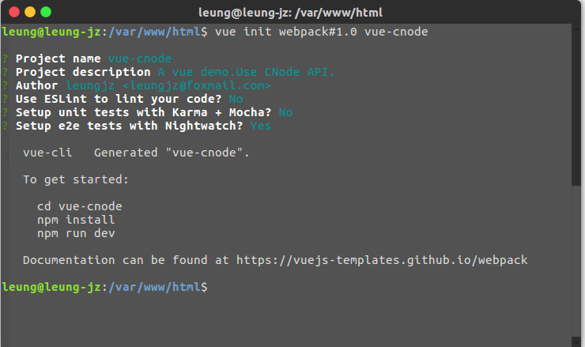
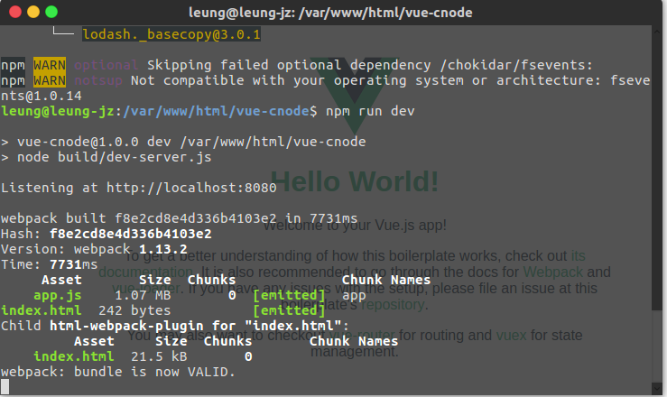
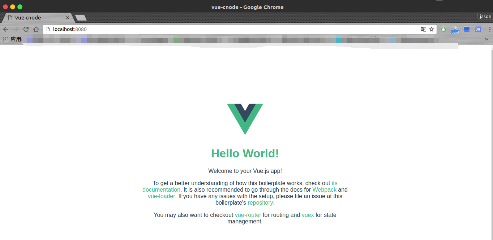
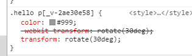
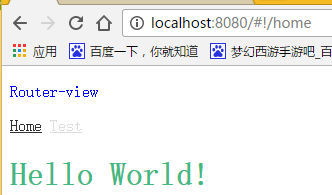
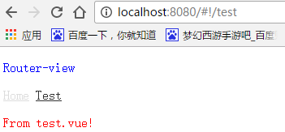
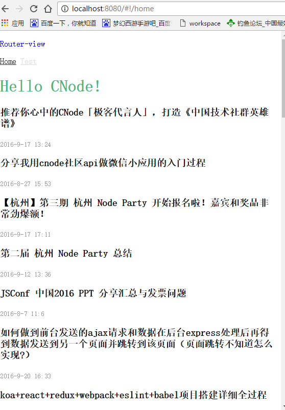
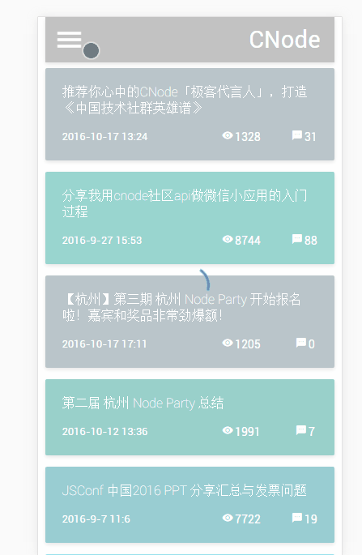

最近公司一直在催开发，导致基本没时间记录下学习的过程了。刚好有个小项目需要用到Vue，于是顺便学习下使用 vue-cli + webpack 来进行单页面应用开发。
<!-- more -->
趁着稍微有一点点时间，就简单记录一下开发的过程（文中的应用为CNode的单页面应用，API数据均由CNode提供）。

1.  安装基本工具
    在控制台中输入 `npm i -g vue-cli webpack`
    安装成功后显示如下图：
2.  新建项目
    1.  先进入工作区间 `cd /your/workspace`
    2.  新建 vue1.0 的项目 `vue init webpack#1.0 your-project-name` 并进入项目目录 `cd your-project-name`
    
    在新建项目时，需要输入的参数有：
    *   项目名
    *   项目的描述
    *   坐着
    *   是否使用ESLint进行校验（因为不喜欢2个空格的tab所以我选择了不校验）
    *   是否使用 karma 和 mocha 进行测试（不熟悉，所以先不是用）
    *   这一行不懂，所以跳过

    3.  安装相关依赖 `npm i`
    4.  运行项目 `npm run dev`
    
    
    到现在我们已经成功搭好了vue的脚手架了。接下来是整个项目中比较难的部分了。
3.  webpack 配置
    webpack的思想是把每个静态资源文件当做一个模块加载，我们需要做一些配置，在这里我们需要用到编译sass模块，多以我们还需要安装`css-loader`,`style-loader`,`node-sass`。
    **安装推荐使用 `npm i --save modules` 命令安装**

    同时还需要让webpack自动添加css前缀因此需要安装`autoprefixer-loader`。安装完成后，修改webpack的辅助工具（我的路径是`build/utils.js`）中的 `cssLoader` 配置：
    ```javascript
    return {
        css: generateLoaders(['css', 'autoprefixer']),
        // other loader.
      }
    ```
    下面是部分webpack配置文件的注解（如有错误请提出）：
    ```javascript
    var path = require('path')
    var config = require('../config')
    var utils = require('./utils')
    var projectRoot = path.resolve(__dirname, '../')

    module.exports = {
        //入口文件
        entry: {
            app: './src/main.js'
        },
        //输出配置
        output: {
            //输出路径，绝对路径。
            path: config.build.assetsRoot,
            //公共文件生成路径
            publicPath: process.env.NODE_ENV === 'production' ? config.build.assetsPublicPath : config.dev.assetsPublicPath,
            //文件名
            filename: '[name].js'
        },
        resolve: {
            //导入包时可以省略的文件后缀，导入 ./components/home.vue 时可以直接导入 ./components/home
            extensions: ['', '.js', '.vue'],
            //路径别名，可以使用别名代替，导入 ./components/home 时可以直接导入 components/home
            alias: {
                'src': path.resolve(__dirname, '../src'),
                'assets': path.resolve(__dirname, '../src/assets'),
                'components': path.resolve(__dirname, '../src/components')
            }
        },

        module: {
            //加载器
            loaders: [{
                //vue文件解析
                test: /\.vue$/,
                loader: 'vue'
            }, {//js文件解析
                test: /\.js$/,
                loader: 'babel',
                include: projectRoot,
                exclude: /node_modules/
            }, {//json文件解析
                test: /\.json$/,
                loader: 'json'
            }, {//html文件解析
                test: /\.html$/,
                loader: 'vue-html'
            }, {//图片解析
                test: /\.(png|jpe?g|gif|svg)(\?.*)?$/,
                loader: 'url',
                query: {
                    //小于10k使用base64格式
                    limit: 10240,
                    //图片名称
                    name: utils.assetsPath('img/[name].[hash:7].[ext]')
                }
            }, {//字体
                test: /\.(woff2?|eot|ttf|otf)(\?.*)?$/,
                loader: 'url',
                //小于100k使用base64格式
                query: {
                    limit: 102400,
                    name: utils.assetsPath('fonts/[name].[hash:7].[ext]')
                }
            }]
        },
        vue: {
            loaders: utils.cssLoaders()
        }
    }

    ```
    为了测试一下上述 loader 是否有效，修改 `Home.vue` 中的部分代码：
    template 部分：
    ```html
    <p>我会旋转.</p>
    ```
    style 部分：
    ```scss
    //记得lang要设置为scss
    <style scoped lang="scss">
    h1 {
      color: #42b983;
    }
    img{
        width: 100%;
    }
    .hello{
        p{
            color: #999;
            transform: rotate(30deg);
        }
    }
    </style>
    ```
    重启测试服务器并打开 `localhost:8080`可以看到下列效果：
    
    打开控制台查看css样式时，发现已经自动添加了前缀。
    
    到此为止，webpack 的配置可以告一段落了，下面可以开始开发我们的应用。
4.  实现demo
    1.  使用路由插件 `vue-router`
        安装插件： `npm i --save
        vue-router@0.7.3`。此处使用0.7.3版本的原因是新版的插件（2.0版本以上）都只支持vue2.0版本，因此我们使用支持vue1.0的最新版。
        >注意: vue-router@2.x 只适用于 Vue 2.x 版本。

        然后我们需要修改入口文件 `main.js`：
        ```javascript
        import Vue from 'vue'
        import App from './App'
        //导入并注册vue-router插件
        import VueRouter from 'vue-router';
        Vue.use(VueRouter);

        //导入两个页面
        import Home from 'components/Home';
        import Test from 'components/test';
        //新建一个路由
        var router = new VueRouter();
        //定义路由跳转地址
        router.map({
            '/home': {
                component: Home
            },
            '/test': {
                component: Test
            }
        })
        //设置未定义路由跳转的页面
        router.redirect({
            //所有未定义的路由都跳转到根目录
            '*': '/home',
            '/': '/home'
        })
        //开启路由
        router.start(App, '#app');
        ```
        在components下新建两个页面：
        `Home.vue`：
        ```html
        <template>
            <div class="hello">
                <h1>{{ msg }}</h1>
            </div>
        </template>

        <script>
        export default {
          data () {
            return {
                //提示，修改该行不会触发热更新，因为更新组件会对当前状态和初始状态进行对比。
                msg: 'Hello World!'
            }
          }
        }
        </script>
        <!-- 添加 scope 属性可以限制这些style的作用域，仅在该组件中生效 -->
        <style scoped>
        h1 {
          color: #42b983;
        }
        </style>
        ```

        `test.vue`：
        ```html
        <template lang="html">
            <p>
                {{msg}}
            </p>
        </template>

        <script>
        export default {
          data() {
            return {
                msg: 'From test.vue!'
            }
          },
          computed: {},
          mounted() {},
          methods: {},
          components: {}
        }
        </script>

        <style lang="scss" scoped>
            p{
                color: red;
            }
        </style>
        ```
        再修改一下 `app.vue`：
        ```html
        <template>
        <div class="container">
            <p>Router-view</p>
            <a v-link="{path:'/home', activeClass:'active'}">Home</a>
            <a v-link="{path:'/test', activeClass:'active'}">Test</a>
            <router-view keep-alive></router-view>
        </div>
        </template>

        <script>
        import Hello from './components/Hello'

        export default {
            name: 'App'
        }
        </script>

        <style lang="scss">
        p{
            color: blue;
        }
        a{
            color: #ddd;
            &.active{
                color: #333;
            }
        }
        </style>
        ```
        保存所有修改的文件，可以在浏览器中看到效果：
        
        
        可以发现，每个style均在自己的作用域中生效，而且不同的路径对应不同的页面。
    2.  使用 `vue-resource` 插件请求数据
        页面有了，我们先来使用 `vue-resource` 插件来向服务器请求数据，并将数据显示在页面中。
        在 `main.js` 中导入插件：

        ```javascript
        import VueResource from 'vue-resource';
        Vue.use(VueResource);
        ```
        考虑到在之后会频繁使用到请求，因此可以将所有的请求都封装到一个文件中，使用的时候再导入即可。
        新建 `utils` 文件，并新建 `request.js` 文件：

        ```javascript
        import Vue from 'vue';
        module.exports = {
            getTopics(callback, params){
                !params && (params = {});
                Vue.http({
                    url: 'https://cnodejs.org/api/v1/topics',
                    params: params,
                    method: 'GET'
                }).then(callback);
            }
        }
        ```
        然后在 `Home.vue` 文件中添加：
        `template`:
        ```html
        <div class="topics" v-for="topic in topics">
            <h3 class="title">{{topic.title}}</h3>
            <p><small>{{topic.create_at | parseDate}}</small></p>
        </div>
        ```
        `script`:
        ```javascript
        import Vue from 'vue';
        //导入请求数据的辅助函数
        import Topics from '../utils/request';

        //添加一个自定义过滤器，用于格式化时间
        Vue.filter('parseDate', function(input){
            var date = new Date(input);
            var formatter = 'YYYY-MM-DD HH:mm';
            return formatter.replace('YYYY', date.getFullYear())
                            .replace('MM', date.getMonth())
                            .replace('DD', date.getDate())
                            .replace('HH', date.getHours())
                            .replace('mm', date.getMinutes())
        })

        export default {
            data () {
                return {
                    //提示，修改该行不会触发热更新，因为更新组件会对当前状态和初始状态进行对比。
                    msg: 'Hello CNode!',
                    //初始化topics数组
                    topics: []
                }
            },
            attached(){
                Topics.getTopics((responce)=>{
                    var responceData = responce.body
                    this.$set('topics', responceData.data);
                })
            }
        }
        ```
        重新打开浏览器可以看到：
        
        可以看到，数据已经从后台请求回来了。接下来可以对数据进行开发，优化等。
5.  结语
    憋了好久了，终于写完了一个简易的基于vue1.0+webpack的教程了。下面的GitHub链接是最终实现的demo（实现了显示获取首页数据，文章详细内容，文章的评论等），该demo还有很多需要优化的改善的地方，我会慢慢地进行完善了，欢迎各位进行star。

    [GitHub传送门](https://github.com/JZLeung/Vue-CNode)
    小demo展示（使用了`vue-material-components`）：
    
